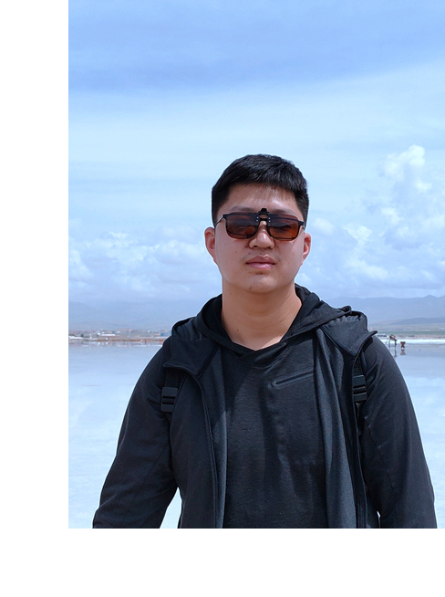

---
hide:
  - navigation
---

# Xichen Pan

{ align=right style="zoom:50%;"}

## Bio

I am currently a Research Assistant at Microsoft Research Asia, mentored by [Dr. Li Dong](http://scholar.google.com/citations?user=wEfQgPgAAAAJ&hl=en). My research interest lies in multimodal learning with a focus on vision, language, and audio modalities. I am especially interested in multimodal representation learning and multimodal self-supervised pre-training. Previously, I obtained my bachelor’s degree in Computer Science from [Shanghai Jiao Tong University (SJTU)](https://www.sjtu.edu.cn/) and won the Best Thesis Award. I was fortunately advised by and maintain a close connection with [Prof. Zhouhan Lin](https://jhc.sjtu.edu.cn/people/members/faculty/zhouhan-lin.html) at SJTU.

Email: [xcpan [dot] mail [at] gmail [dot] com](mailto:xcpan.mail@gmail.com)

[:fontawesome-solid-envelope:](mailto:xcpan.mail@gmail.com) [:academicons-google-scholar:](https://scholar.google.com/citations?user=9wh9VXIAAAAJ&hl=en) [:academicons-semantic-scholar:](https://www.semanticscholar.org/author/Xichen-Pan/2158877024) [:academicons-dblp:](https://dblp.org/pid/317/0180.html) [:fontawesome-brands-linkedin:](https://www.linkedin.com/in/xichenpan/) [:fontawesome-brands-github:](https://github.com/Flash-321) [:fontawesome-brands-zhihu:](https://www.zhihu.com/people/pan-xi-chen-54) [:academicons-cv:](sources/Xichen_CV.pdf)

## News

[June 2022] My bachelor thesis won Best Thesis Award in SJTU! Thanks my advisor [Prof. Zhouhan Lin](https://jhc.sjtu.edu.cn/people/members/faculty/zhouhan-lin.html), checkout the [news](http://www.jwc.sjtu.edu.cn/info/1258/11735.htm).

[Feb. 2022] Our paper was accepted by [ACL 2022](https://www.2022.aclweb.org/) Main Conference, checkout [full paper](https://aclanthology.org/2022.acl-long.308/).

## Education

### Shanghai Jiao Tong University

*Sept. 2018 -- June 2022*

***B.Eng. in Computer Science (Outstanding Graduate of Class 2022)**, advised by [Prof. Zhouhan Lin](https://jhc.sjtu.edu.cn/people/members/faculty/zhouhan-lin.html)*

## Publications & Manuscripts

**Synthesizing Coherent Story with Auto-Regressive Latent Diffusion Models**

<u>Xichen Pan</u>, Pengda Qin, Yuhong Li, Hui Xue, and Wenhu Chen

*CVPR 2023 Under Review* [:academicons-arxiv:](http://arxiv.org/abs/2211.10950) [:fontawesome-brands-github:](https://github.com/Flash-321/ARLDM)

**Towards Diverse Lip Reading Representations**

<u>Xichen Pan</u>, Zekai Li, Yichen Gong, Xinbing Wang, and Zhouhan Lin

*ICASSP 2023 Under Review*

**Multimodal Audio-Visual Speech Recognition System Based On Pre-trained Models**

<u>Xichen Pan</u>

*Bachelor thesis at Shanghai Jiao Tong University (Best Thesis Award, 1st/150)*

**Leveraging Unimodal Self-Supervised Learning for Multimodal Audio-visual Speech Recognition**

<u>Xichen Pan</u>, Peiyu Chen, Yichen Gong, Helong Zhou, Xinbing Wang, and Zhouhan Lin

[*ACL 2022 Main Conference*](https://aclanthology.org/2022.acl-long.308/) [:academicons-arxiv:](https://arxiv.org/abs/2203.07996) [:fontawesome-brands-github:](https://github.com/LUMIA-Group/Leveraging-Self-Supervised-Learning-for-AVSR)

## Selected Projects

**[:fontawesome-brands-github: CS Masters Application](https://csmsapp.github.io/) **

A GitHub page built for reference in selecting CS master programs in north America. The page is powered by [Material for MkDocs](https://squidfunk.github.io/mkdocs-material/) and supports collaboration through Pull Requests and GitHub Actions.

## Experience
**Microsoft Research Asia**

*Nov. 2022 – Present*

*StarBridge Program Research Assistant*

**Alibaba Group**

*Sept. – Nov. 2022*

*Research Intern*

**Horizon Robotics**

*Apr. 2021 – July 2022*

*Research Intern*

**John Hopcroft Center for Computer Science, Shanghai Jiao Tong University**

*Apr. 2021 – June 2022*

*Research Intern*

**NSF Center for Big Learning, University of Florida**

*July – Sept. 2020*

*Research Intern*

## Media Exposures

[Synthesizing Coherent Story with Auto-Regressive Latent Diffusion Models](https://www.jiqizhixin.com/articles/2022-11-27), Synced

## Some of my Friends

??? Click to expand
    Georgia Tech: [Haotian Xue](https://xavihart.github.io/)
    
    Shanghai Jiao Tong University: [Yanjie Ze](https://yanjieze.com/) 
    
    Wuhan University: [Youming Deng](https://denghilbert.github.io/) 
