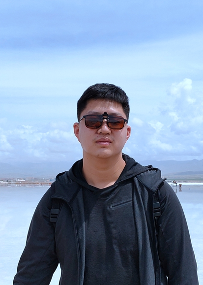

---
hide:
  - navigation
  - toc
---

# Xichen Pan { align=right style="width:7.5em; margin-left: 7.5em; margin-top: 0.5em; border-radius: 1em;"}

*:fontawesome-solid-building: Office: [424, 60 5th Ave, New York, NY 10011](https://maps.app.goo.gl/N7m2fM5EbM3TToB79)*

*:fontawesome-solid-inbox: Work Email: [xichenpan [at] nyu [dot] edu](mailto:xichenpan@nyu.edu)*

*:fontawesome-solid-inbox: Personal Email: [xcpan [dot] mail [at] gmail [dot] com](mailto:xcpan.mail@gmail.com)*

[:academicons-google-scholar:](https://scholar.google.com/citations?user=9wh9VXIAAAAJ&hl=en) [:academicons-semantic-scholar:](https://www.semanticscholar.org/author/Xichen-Pan/2158877024) [:fontawesome-brands-github:](https://github.com/xichenpan) [:fontawesome-brands-linkedin:](https://www.linkedin.com/in/xichenpan/) [:fontawesome-brands-x-twitter:](https://twitter.com/xichen_pan) [:fontawesome-brands-zhihu:](https://www.zhihu.com/people/xichenpan)

## Bio

I am a first-year Ph.D. student of Computer Science at [NYU Courant](https://cs.nyu.edu/home/index.html), advised by Prof. [Saining Xie](https://www.sainingxie.com/). I interned at Microsoft Research Asia (2022-2023 with Dr. [Li Dong](http://dong.li/)), Alibaba Group (2022 with Dr. [Pengda Qin](https://scholar.google.com/citations?user=n7bubTwAAAAJ&hl=en)), and Horizon Robotics (2021-2022 with [Yichen Gong](https://scholar.google.com/citations?user=e3bTLycAAAAJ&hl=en)). Previously, I obtained my bachelor’s degree in Computer Science from [Shanghai Jiao Tong University (SJTU)](https://en.sjtu.edu.cn/) and won the [Best Thesis Award](http://www.jwc.sjtu.edu.cn/info/1258/11735.htm). I was fortunately advised by and maintain a close connection with Prof. [Zhouhan Lin](https://hantek.github.io/) at SJTU.

## Research Interest

### Generative Models
Designing more controlable and high fidelity methods for image, video, and 3D generation, with a focus on:

- Preserving spatial and temporal consistency

- Leveraging text-to-image priors for advanced applications

### Multimodal Learning
Developing vision-language models for vision-centric applications, focusing on representation learning and self-supervised pre-training

## News

[02/2024] I will join :fontawesome-brands-meta: Meta GenAI as a Research Scientist Intern in 2024 Summer. See you in Menlo Park!

[01/2024] :church: Our paper was accepted by ICLR 2024, check it out [here](https://xichenpan.com/kosmosg/). See you in Vienna!

[10/2023] :beach_with_umbrella: Our paper was accepted by WACV 2024 as Oral, check it out [here](https://openaccess.thecvf.com/content/WACV2024/html/Pan_Synthesizing_Coherent_Story_With_Auto-Regressive_Latent_Diffusion_Models_WACV_2024_paper.html).

[09/2023] :party_popper: Excited to start my CS Ph.D. at [NYU Courant](https://cs.nyu.edu/home/index.html) advised by Prof. [Saining Xie](https://www.sainingxie.com/).

[12/2022] Glad to work with Dr. [Li Dong](http://dong.li/) and Dr. [Furu Wei](https://thegenerality.com/) at Microsoft Research Asia for the upcoming year, leading up to Fall 2023.

[06/2022] My bachelor thesis won Best Thesis Award in SJTU! Thanks my advisor Prof. [Zhouhan Lin](https://hantek.github.io/), checkout the [honor roll](https://sjcg.jwc.sjtu.edu.cn/).

[02/2022] Our paper was accepted by [ACL 2022](https://www.2022.aclweb.org/) Main Conference, check out [full paper](https://aclanthology.org/2022.acl-long.308/).

## Education

### New York University Courant Institute{ align=right style="height:6em; border-radius: 0.5em;"}

*Sept. 2023 -- Present*

***Ph.D. in Computer Science**, advised by Prof. [Saining Xie](https://sainingxie.com/)*

### Shanghai Jiao Tong University{ align=right style="height:6em; border-radius: 0.5em;"}

*Sept. 2018 -- June 2022*

***B.Eng. in Computer Science (Outstanding Graduate of Class 2022)**, advised by Prof. [Zhouhan Lin](https://hantek.github.io/)*

## Publications & Manuscripts

**Image Sculpting: Precise Object Editing with 3D Geometry Control**

[Jiraphon Yenphraphai](https://domejiraphon.github.io/), <u>Xichen Pan</u>, [Sainan Liu](https://www.linkedin.com/in/sainan-stephanie-liu/), [Daniele Panozzo](http://cs.nyu.edu/~panozzo/), [Saining Xie](https://www.sainingxie.com/)

*In Submission*&nbsp;&nbsp; [:academicons-arxiv: arXiv](https://arxiv.org/abs/2401.01702)&nbsp;&nbsp;[:fontawesome-brands-github: Code](https://github.com/vision-x-nyu/image-sculpting)&nbsp;&nbsp;[:fontawesome-solid-link: Project Page](https://image-sculpting.github.io/)

**Kosmos-G: Generating Images in Context with Multimodal Large Language Models**

<u>Xichen Pan</u>, [Li Dong](https://dong.li/), [Shaohan Huang](https://buaahsh.github.io/), [Zhiliang Peng](https://pengzhiliang.github.io/), [Wenhu Chen](https://wenhuchen.github.io/), [Furu Wei](https://thegenerality.com/)

*ICLR 2024*&nbsp;&nbsp;[:academicons-arxiv: arXiv](https://arxiv.org/abs/2310.02992)&nbsp;&nbsp;[:fontawesome-brands-github: Code](https://aka.ms/Kosmos-G)&nbsp;&nbsp;[:fontawesome-solid-link: Project Page](https://xichenpan.com/kosmosg/)

**Synthesizing Coherent Story with Auto-Regressive Latent Diffusion Models**

<u>Xichen Pan</u>, [Pengda Qin](https://scholar.google.com/citations?user=n7bubTwAAAAJ&hl=en), [Yuhong Li](https://colfire.github.io/), [Hui Xue](https://scholar.google.com/citations?user=lrf-wkQAAAAJ&hl=en), [Wenhu Chen](https://wenhuchen.github.io/)

*[WACV 2024 (Oral, Top 6% of accepted papers)](https://openaccess.thecvf.com/content/WACV2024/html/Pan_Synthesizing_Coherent_Story_With_Auto-Regressive_Latent_Diffusion_Models_WACV_2024_paper.html)*&nbsp;&nbsp;[:academicons-arxiv: arXiv](http://arxiv.org/abs/2211.10950)&nbsp;&nbsp;[:fontawesome-brands-github: Code](https://github.com/xichenpan/ARLDM)

**Multimodal Audio-Visual Speech Recognition System Based On Pre-trained Models**

<u>Xichen Pan</u>

*Bachelor thesis at Shanghai Jiao Tong University (Best Thesis Award, 1st/150)*&nbsp;&nbsp;[:fontawesome-regular-newspaper: News](http://www.jwc.sjtu.edu.cn/info/1258/11735.htm)&nbsp;&nbsp;[:fontawesome-solid-graduation-cap: Honor Roll](https://sjcg.jwc.sjtu.edu.cn/)

**Leveraging Unimodal Self-Supervised Learning for Multimodal Audio-visual Speech Recognition**

<u>Xichen Pan</u>, [Peiyu Chen](https://www.linkedin.com/in/peiyu-chen-9b407a218/), [Yichen Gong](https://scholar.google.com/citations?user=e3bTLycAAAAJ&hl=en), [Helong Zhou](https://scholar.google.com/citations?user=wkhOMMwAAAAJ&hl=zh-CN), [Xinbing Wang](https://www.cs.sjtu.edu.cn/~wang-xb/), [Zhouhan Lin](https://hantek.github.io/)

*[ACL 2022 Main Conference](https://aclanthology.org/2022.acl-long.308/)*&nbsp;&nbsp;[:academicons-arxiv: arXiv](https://arxiv.org/abs/2203.07996)&nbsp;&nbsp;[:fontawesome-brands-github: Code](https://github.com/LUMIA-Group/Leveraging-Self-Supervised-Learning-for-AVSR)

## Experience
**Microsoft Research Asia**{ align=right style="height:5em; border-radius: 0.5em;"}

*Dec. 2022 – Sept. 2023*

*StarBridge Program Research Assistant*

**Alibaba Group**{ align=right style="height:5em; border-radius: 0.5em;"}

*Sept. – Dec. 2022*

*Research Intern*

**Horizon Robotics**{ align=right style="height:5em; border-radius: 0.5em;"}

*Apr. 2021 – July 2022*

*Research Intern*

**John Hopcroft Center for Computer Science, Shanghai Jiao Tong University**{ align=right style="height:5em; border-radius: 0.5em;"}

*Apr. 2021 – June 2022*

*Research Intern*

**NSF Center for Big Learning, University of Florida**{ align=right style="height:5em; border-radius: 0.5em;"}

*July – Sept. 2020*

*Research Intern*

## Selected Projects

**[:fontawesome-brands-github: Open CS Application](https://opencs.app/) **

An open-source GitHub page built for reference in selecting CS programs in north America. The page is powered by [Material for MkDocs](https://squidfunk.github.io/mkdocs-material/) and supports collaboration through Pull Requests and GitHub Actions.

## Media Exposures

[Synthesizing Coherent Story with Auto-Regressive Latent Diffusion Models](https://www.jiqizhixin.com/articles/2022-11-27), Synced

??? tip "Some of My Friends"
    Cornell: [Youming Deng](https://denghilbert.github.io/) 

    Georgia Tech: [Haotian Xue](https://xavihart.github.io/)
    
    Neon, Inc.: [Alex Chi (Prev: CMU)](https://www.skyzh.dev/)

    New York University: [Hexu Zhao](https://tarzanzhao.github.io/)
    
    Ohio State University: [Kai Zhang](https://drogozhang.github.io/)
    
    Shanghai Jiao Tong University: [Xinyu Xu](https://xuxinyu.website/), [Yanjie Ze](https://yanjieze.com/), [Junyi Zhang](https://www.junyi42.com/)

    UC Berkeley: [Yichuan Wang](https://yichuan520030910320.github.io/)
    
    UC Santa Barbara: [Kexun Zhang](https://zkx06111.github.io/)

    UMich: [Yiming Dou](https://dou-yiming.github.io/)
                         
    University of Washington: [Zihan Li](https://huanglizi.github.io/)
    
    USC: [Di Chang](https://boese0601.github.io/)

    

        This Site Already Has 
            <small></small>
         Visitors
    

    

        
    

